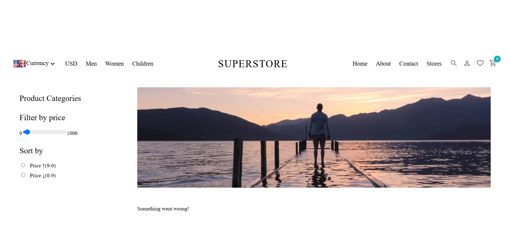

# Superstore-Ecommerce




SuperStore is a modern e-commerce platform specializing in clothing, offering users a seamless shopping experience for the latest brand trends and styles.


## Features

- 🛍️ **Product Catalog**: Browse through a wide range of shoes with detailed product pages
- 🔍 **Advanced Search**: Find products by category, age, size, collection
- 💳 **Secure Checkout**: Multiple payment options with secure transactions

## Technologies Used

### Frontend
- React.js
- HTML5 & CSS3
- Redux
- MUI Icons
- SASS

### Backend
- Strapi
- MySQL

### Payment Integration
- Stripe API

### Other Tools
- Git/GitHub
- Vite

## Installation Client

1. Clone the repository:
   ```bash
   git clone https://github.com/superGemHere/Superstore-Ecommerce.git
   ```
2. Navigate to the client directory:
   ```bash
   cd client
   ```
3. Install dependencies:
   ```bash
   npm install
   ```
4. Set up environment variables, for development server:
   ```
  VITE_APP_TOKEN = 3ca971d4a5b11802294713b28f0c5a59f2a2d3bdbe9a0e81dc3c5ce0ecfc47b8c2b2ebf8d23e6d01786cd6e8ce8e4a3cc06b2855c1bd9ac235b02b79de4794999a7471e8156127dcc4a5ebfc80b39f930247e17612c2033d61e3f0d90c721a976d41de6e65b8936e2a7195a49a850d364df403cabca7adc683a4aad98ee78818
   VITE_APP_URL = http://localhost:1337/api
   VITE_APP_UPLOAD_URL = http://localhost:1337
   ```
5. Start the development server:
   ```bash
   npm run dev
   ```
## Installation Server

1. Clone the repository:
   ```bash
   git clone https://github.com/superGemHere/Superstore-Ecommerce.git
   ```
2. Navigate to the client directory:
   ```bash
   cd api
   ```
3. Install dependencies:
   ```bash
   npm install
   ```
4. Set up environment variables.
  
5. Start the development server:
   ```bash
   npm start
   ```
